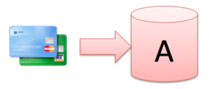
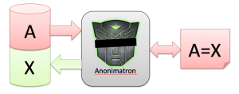
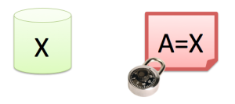

# Anonimatron

No patience? Visit the [Anonimatron official homepage](https://realrolfje.github.io/anonimatron/ "Anonimatron"), download the latest version, unzip it and run `anonimatron.sh` or `anonimatron.bat`.

[Travis build status for master branch: ](https://travis-ci.org/realrolfje/anonimatron)

### Table of contents

+ [How Anonimatron Works](#how-anonimatron-works)
+ [Quick Start](#quick-start)
  + [Setting up a test database](#setting-up-a-test-database)
  + [Installing Anonimatron](#installing-anonimatron)
  + [Configuring Anonimatron](#configuring-anonimatron)
  + [Anonymize!](#anonymize)

## How Anonimatron Works

In every software project, there comes a time where a bug pops up, nobody knows how to reproduce it, and somebody says “I know, let’s test this against a copy of the production database”. Even with the best intentions, once production data leaves the production machine with all its safeguards it becomes really hard to do access control on that data.

Most of the time, it’s not even needed to have that data. Developers just need a data set which resembles the production scenario close enough. Some brave souls have mixed succes with data generators, but those generators usually are tedious to maintain and die a slow death under the pressure of the daily grind.

In some ambitious projects automated integration testcases are built on top of the data which was inserted by the data generators. As the generators die, so die the tests. If you recognize this pattern, Anonimatron might be the answer for you.



So let’s say you’re working on release 5 of a big webshop, and because of the succes of the shop, it runs into performance problems. There’s no time or budget to build a data generator, and before you can say no, you have a copy of the production data on some development server, containing the creditcard data of your customers. What do you do?

This is where Anonimatron comes in. Anonimatron can de-personalize or anonymize your data for you, give you total control over what gets anonymized, and how, and thinks of data types as “color” or “address” instead of “int” and “String”. Here’s how that works:



For every distinct, unique value A, Anonimatron creates a replacement value X, and writes that back to the database. It stores the A=X relation in a Synonym, and consistently applies those Synonyms throughout all tables in the database.

By using synonyms, Anonimatron makes sure that your database is still statistically roughly the same as before anonymization, and also makes sure that if you have two tables with a “lastname” column, matching records will actually still match.

Anonimatron (optionally) stores these synonyms for later use, so it can be consistent between different runs. New production data? No problem. Load it, tell Anonimatron to use the old synonyms, and the old data will be Anonymized exactly the same as the last time. Only new records will generate new synonyms, which of course will be added to the synonym file for the next run.

This feature also enables you to write testscripts based on anonymized production data. Your scripts will not easily break, because new production copies are anonymized very consistently.



After the anonymization process, the private data will be in the synonym file. This file needs to be put in a (very) safe place, and only the people that import production data and run Anonimatron should be able to access this file.

After anonymization, developers can access the database without immediately being exposed to private addresses of customers, bank accounts, or whatnot. Of course this all depends on what you tell Anonimatron to do, and what to anonymize.

Remember, with great power comes great responsibility. Try to stay away from customer data as much as you can, and handle it with deep respect when you get it, delete it or depersonalize it as soon as you can. Use Anonimatron wisely.

It’s the Law.

## Quick Start

Downloading and starting Anonimatron should produce some help texts and pointers which should set you off in the right direction. Less adventurous or in a big hurry? Let us show you how simple it is to install and configure Anonimatron on an example MySQL database.

### Setting up a test database

To demonstrate what Anonimatron can do to your data, we will create a little test database to play with. Anonimatron connects to all kinds of databases, including MySQL, Postgress and Oracle. In this example, we use MySQL. Here are all the statements you need to create a little database with 2 tables, a user, and some “private” data:

```SQL
create database mydb;
create user myuser identified by 'mypassword';
grant all privileges on *.* to 'myuser'@'localhost'
       identified by 'mypassword' with grant option;
 
create table mydb.userdata (
         id int not null auto_increment primary key,
         firstname varchar(20),
         lastname varchar(20),
         creditcardnr varchar(20)
       );
 
create table mydb.lastnames (
         id int not null auto_increment primary key,
         lastname varchar(20)
       );
 
insert into mydb.userdata
       (firstname,lastname, creditcardnr)
values ('Homer', 'Simpson','1234'),
       ('Marge', 'Simpson','5678'),
       ('Ned', 'Flanders','3456'),
       ('Charles', 'Burns','3456');
 
insert into mydb.lastnames (lastname)
values ('Simpson'), ('Flanders'), ('Burns');
```

After all the hard work, you should be able to connect to the database with ‘myuser’ and see the “private” data in there:

```SQL
select * from mydb.userdata;
```

| id | firstname | lastname | creditcardnr |
|----|-----------|----------|--------------|
| 1  | Homer     | Simpson  | 1234         |
| 1  | Homer     | Simpson  | 1234         |
| 2  | Marge     | Simpson  | 5678         |
| 3  | Ned       | Flanders | 3456         |
| 4  | Charles   | Burns    | 3456         |

```SQL
select * from mydb.lastnames;
```

| id | lastname  |
|----|-----------|
| 1  | Simpson   |
| 2  | Flanders  |
| 3  | Burns     |

Let’s pretend that this is a copy of a production database, and you want to de-personalize or anonymize it.

### Installing Anonimatron

To anonymize your data, [download Anonimatron](https://github.com/realrolfje/anonimatron/zipball/master) and unzip it in a directory of your choice. You should find an “anonimatron.sh” and “anonimatron.bat” file there. Depending on your system, run it without arguments. If you have java installed on your system you should see something like this:

```
$ ./anonimatron.sh
 
This is Anonimatron 1.7, a command line tool to consistently
replace live data in your database with data data which
can not be traced back to the original data.
You can use this tool to transform a dump from a production
database into a large representative dataset you can
share with your development and test team.
Use the -configexample command line option to get an idea of
what your configuration file needs to look like.
 
usage: java -jar anonimatron.jar
 -config      The XML Configuration file describing what to
                   anonymize.
 -configexample    Prints out a demo/template configuration file.
 -dryrun           Do not make changes to the database.
 -synonyms    The XML file to read/write synonyms to. If the file
                   does not exist it will be created.
```

Victory! You’ve installed Anonimatron. Yes, life can really be that easy.

### Configuring Anonimatron

Next, we need to tell Anonimatron how to connect to our database, and which tables and columns to process and how. The hardest part of this is probably figuring out how to create a jdbc connect string. Anonimatron can help you with that. If you start anonimatron with the “-configexample” parameter, it will scan the jdbcdrivers directory for available and supported drivers, and will show you how a jdbc URL for any of these should look:

```
$ ./anonimatron.sh -configexample
 
Supported Database URL formats:
Jdbc URL format                        By Driver
jdbc:oracle:oci8:@[SID]                oracle.jdbc.driver.OracleDriver
jdbc:oracle:thin:@[HOST]:[PORT]:[SID]  oracle.jdbc.driver.OracleDriver
jdbc:oracle:oci:@[SID]                 oracle.jdbc.driver.OracleDriver
jdbc:postgresql://[HOST]:[PORT]/[DB]   org.postgresql.Driver
jdbc:mysql://[HOST]:[PORT]/[DB]        org.gjt.mm.mysql.Driver
 
Anonimatron will try to autodetect drivers which are
stored in the lib directory. Add you driver there.
 
...
```
In this example, we have just created a MySQL database, so we’ll use that URL and fill in the blanks. We use the rest of the configuration example and with some copy-pasting we come up with the following configuration:

```XML
<?xml version="1.0" encoding="UTF-8"?>
<configuration jdbcurl="jdbc:mysql://localhost:3306/mydb"
               userid="mydata" password="mypassword">
 
  <table name="userdata">
    <column name="firstname" type="ROMAN_NAME" />
    <column name="lastname" type="ELVEN_NAME" />
    <column name="creditcardnr" type="RANDOMDIGITS"/>
  </table>
 
  <table name="lastnames">
    <column name="lastname" type="ELVEN_NAME" />
  </table>
</configuration>
```

This simple configuration file will tell Anonimatron the following things:

+ How to connect to the mydb database
+ The values in `username.firstname` should be processed with the `ROMAN_NAME` Anonymizer.
  Anonymizers are little plugins which are able to generate data with certain properties, 
  sometimes based on the original data. This particular Anonymizer generates Roman Names 
  by picking syllables from a builtin list.
+ The values in `username.lastname` should be replaced by Elven names. This is almost 
  identical to Roman names but with a different Syllable file.
+ The `userdata.creditcardnr` should be replaced by a set of random digits of the same 
  length. In our case, 4 digits will be replaced by 4 differnt digits. Should you really 
  need numbers which are semantically correct credit card numbers, you could write your 
  own Anonymizer plugin. We’ll cover that in a later blogpost.
+ The `lastnames.lastname` column is also an Elven name. Because of the way Anonimatron 
  handles data, strings in this column will be processed exactly the same way as the 
  `userdata.lastname` column, as we will see below.

### Anonymize!

Now that we have configured Anonimatron, it’s time to start it up and tell it to use our configuration file and store synonyms. It will be finished in the blink of an eye, and your output should look somewhat like this:

```
$ ./anonimatron.sh -config config.xml -synonyms synonyms.xml
 
Anonymization process started
 
Jdbc url      : jdbc:mysql://localhost:3306/mydb
Database user : mydata
To do         : 2 tables.
 
Anonymizing table 'lastnames', total progress  [100%, ETA 11:36:56 PM]
Anonymization process completed.
 
Writing Synonyms to synonyms.xml ...[done].
```

If Anonimatron complains or does not run, you might want to check out the anonimatron.log file for clues. Most log entries will be pretty self-explanatory. If not, please register an issue and we’ll see what we can do to fix that.

Let’s check the results. First, we can check what synonyms were generated by looking into the synonyms.xml file we told it to create:

```
$ cat synonyms.xml
<?xml version="1.0" encoding="UTF-8"?>
<synonyms>
  <string type="ELVEN_NAME" from="QnVybnM=" to="RGhvZWxsaWFu"/>
  <string type="ELVEN_NAME" from="RmxhbmRlcnM=" to="QWhlbGhhbGRldGhlc3M="/>
  <string type="ELVEN_NAME" from="U2ltcHNvbg==" to="QWhkdWxlbGhhbGVs"/>
  <string type="ROMAN_NAME" from="SG9tZXI=" to="QmVudWxhdWJlbGl1cw=="/>
  <string type="ROMAN_NAME" from="TmVk" to="RWN1cw=="/>
  <string type="ROMAN_NAME" from="TWFyZ2U=" to="QWxudWxhdWN1cw=="/>
  <string type="ROMAN_NAME" from="Q2hhcmxlcw==" to="QWxudXM="/>
  <string type="RANDOMDIGITS" from="NTY3OA==" to="ODY5OA=="/>
  <string type="RANDOMDIGITS" from="MTIzNA==" to="NDM0Mw=="/>
  <string type="RANDOMDIGITS" from="MzQ1Ng==" to="NjEyNQ=="/>
</synonyms>
```

You’ll note that the “from” and “to” values look a bit garbled. This is because Anonimatron used Base64 encoding to store values of synonyms. This is so that we can store the values bit for bit, without worying about encodings. If you wanted to, you could easily decode these strings by writing a little program.

Even without decoding we can see some interesting things about this file. Remember we had lastnames configured as Elven names? Although we have 4 entries in the username table, we see only 3 Elven names. That is because Homer and Marge have the same lastname. These same synonyms are also used by the lastnames.lastname column. The same goes for the creditcard numbers. As might have noticed that Ned Flanders and Charles Burns used the same credit card number in this system.

Enough staring at XML. Let’s get to what matters most: our database. First, let’s see if the names and numbers have changed:

```SQL
select * from mydb.userdata;
```

| id | firstname     | lastname       | creditcardnr |
|----|---------------|----------------|--------------|
| 1  | Benulaubelius | Ahdulelhalel   | 4343         |
| 2  | Alnulaucus    | Ahdulelhalel   | 8698         |
| 3  | Ecus          | Ahelhaldethess | 6125         |
| 4  | Alnus         | Dhoellian      | 6125         |

That looks much better. The first and lastnames are (almost) pronounceable names which probably would look realistic in a screenshot or testcase, yet there is no trace left of the original data that was there. When we check the lastnames table we see that lastnames are being translated consistently with the userdata table:

```SQL
select * from mydb.lastnames;
```

| id | lastname       |
|----|----------------|
| 1  | Ahdulelhalel   |
| 2  | Ahelhaldethess |
| 3  | Dhoellian      |

This consistent behavior makes sure that queries where the userdata table and the lastnames table are joined based on lastname will still work.

If you want to play some more with Anonimatron, recreate the original tables, add additional (overlapping) data and re-run anonimatron against it with the synonym file you just created. You’ll notice that any “Simpson” lastname will be translated to “Ahdulelhalel” constently on each run. If you don’t want that to happen, simply throw away the synonym file or don’t tell Anonimatron to use it. You can also generate the synonym file first without doing anything to the database by using the -dryrun option, and later do the same run based on the synonyms generated earlier.

Remember: The private data “moved” from the database into the synonyms.xml file we created. So that becomes the new data to watch. Store it in a safe place where nobody can access it.

Have fun experimenting!
