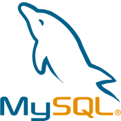

# GDPR compliant testing.

Did you ever have that problem where you needed "production data" to find a bug
or do performance tests outside of the client’s production environment? Are
you worried about protecting that data? Do you add screenshots to your bug
reports? Can you live with surrogate data with the same properties? Then this
tool is for you.

# Features

- Anonymize data in databases and files.
- Generates fake email addresses, fake Roman names, and UUID’s out of the box.
- Easy to configure, automatically generates example config file.
- Anonymized data is consistent between runs. No need to re-write your tests
  to handle random data.
- Extendable, easily implement and add your own anonymization handlers
- 100% Java 1.8, multi platform, runs on Windows, Mac OSX, Linux derivatives.
- Multi database, uses SQL92 standards and supports Oracle, PostgreSQL and
  MySQL out of the box. Anonimatron will autodetect the following JDBC drivers:
  DB2, MsSQL, Cloudscape, Pointbase, Firebird, IDS, Informix, Enhydra,
  Interbase, Hypersonic, jTurbo, SQLServer and Sybase.
- Available as library at
  [Maven Central](https://search.maven.org/search?q=g:%22com.rolfje.anonimatron%22%20AND%20a:%22anonimatron%22).
- 100% free of charge

# Open Source

Anonimatron is an open source project, and gets better with your help. Do you
think you have written an interesting extension, do you want to write useful
documentation, or do you have other suggestions? Please let us now by
[filing a feature request, a bug report](https://github.com/realrolfje/anonimatron/issues), or [join the project at github.com](https://github.com/realrolfje/anonimatron).

# DISCLAIMER
Even if properly
configured, the output of the Anonimatron anonymization process may contain
certain (statistical) properties of the input dataset. That means that even after
Anonymization, you should take reasonable care in protecting the Anonymized
data to prevent leaks.
